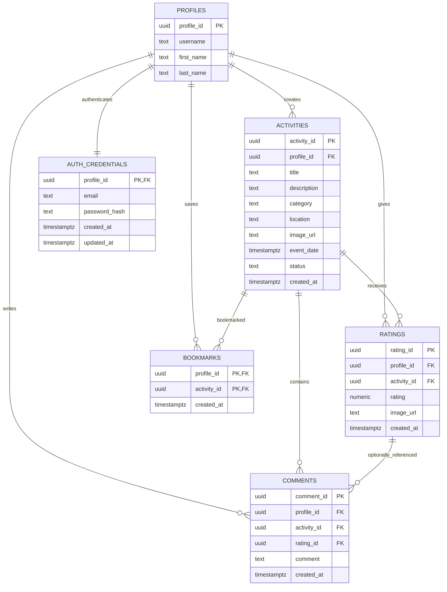
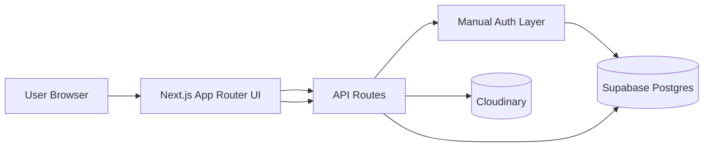
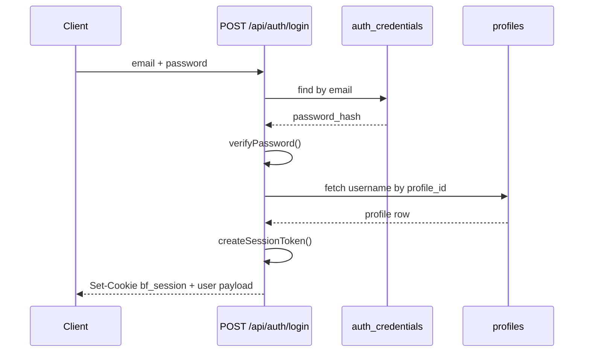
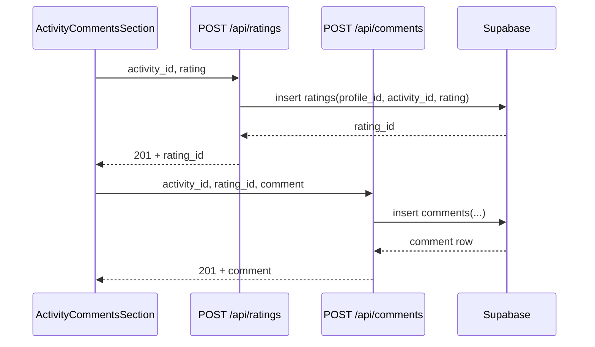
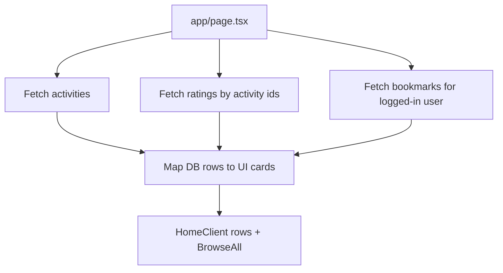

# BruinFun

BruinFun is a UCLA community app for discovering, logging, rating, and discussing activities around campus and LA.

## Current Stack

- Next.js 16 App Router
- TypeScript
- Tailwind CSS v4 + shadcn/ui
- Supabase Postgres
- Manual cookie auth (`bf_session`) using signed tokens
- Cloudinary image uploads
- Vitest for API/component tests

## AI Usage

See [AI_USAGE.md](AI_USAGE.md) for a concise statement on limited AI-assisted workflow in this project.

## How To Start The Website

Option 1: Run locally (clone + env)

1. Clone and enter project

```bash
git clone https://github.com/<your-org-or-user>/bruinfun.git
cd bruinfun
```

2. Install dependencies

```bash
npm install
```

3. Create local env file

```bash
cp .env.example .env.local
```

4. Fill in `.env.local` with team credentials

- `NEXT_PUBLIC_SUPABASE_URL`
- `NEXT_PUBLIC_SUPABASE_ANON_KEY`
- `SUPABASE_SERVICE_ROLE_KEY`
- `AUTH_SECRET`
- `CLOUDINARY_CLOUD_NAME`
- `CLOUDINARY_API_KEY`
- `CLOUDINARY_API_SECRET`

5. Start dev server

```bash
npm run dev
```

6. Open browser

- `http://localhost:3000`

Option 2: Open deployed site on Vercel

1. Go to your team Vercel deployment URL
2. If needed, log in or sign up from the deployed app
3. Use the same core flows as local: browse feed, open activity details, post, bookmark, and view profile

## 3 Distinct Features

1. Dynamic information to user through login, homepage, activity details, rating

- Login sets signed cookie session and personalizes user state
- Homepage dynamically loads activities, ratings summary, and user bookmark state
- Activity details page shows live metadata and supports rating/comment flow

2. Posting activity modal and search bar

- Log Activity modal lets users create new activities with title, category, location, date, description, and image
- Header search surfaces activities and routes users quickly to matching details

3. Bookmarks and profile page

- Users can save/unsave activities through bookmark APIs
- Profile page shows posted, completed, and bookmarked activity views
- Public user profile route supports viewing another user's posted/completed activity history

## Quick Start

1. Install

```bash
npm install
```

2. Create local env

```bash
cp .env.example .env.local
```

3. Required env values

- `NEXT_PUBLIC_SUPABASE_URL`
- `NEXT_PUBLIC_SUPABASE_ANON_KEY`
- `SUPABASE_SERVICE_ROLE_KEY`
- `AUTH_SECRET`
- `CLOUDINARY_CLOUD_NAME`
- `CLOUDINARY_API_KEY`
- `CLOUDINARY_API_SECRET`

4. Run

```bash
npm run dev
```

Open `http://localhost:3000`

## Useful Commands

```bash
npm run dev
npm run build
npm run start
npm run lint
npm run test
npm run test:watch
npm run test:e2e
npm run test:e2e:ui
```

## E2E Test Setup (Playwright)

Use this once on a new machine, then any teammate can run E2E tests directly.

1. Install project dependencies

```bash
npm install
```

2. Install Playwright package if it is missing

```bash
npm install -D @playwright/test
```

3. Install browser binaries used by Playwright

```bash
npx playwright install
```

4. Choose how to run tests

Option A: run against local dev server (default)

```bash
npm run test:e2e
```

This uses `playwright.config.ts` which will auto-start the app at `http://127.0.0.1:3000`.

Option B: run against deployed Vercel URL

```bash
E2E_BASE_URL=https://your-deployment.vercel.app npm run test:e2e
```

PowerShell example:

```powershell
$env:E2E_BASE_URL="https://your-deployment.vercel.app"
npm run test:e2e
```

5. Optional interactive runner

```bash
npm run test:e2e:ui
```

6. Where tests live

- `e2e/auth-flows.spec.ts`

7. Current E2E coverage

- Login auth contract: browser-origin POST to `/api/auth/login` returns `401` with expected error and exact payload shape
- Signup auth contract: browser-origin POST to `/api/auth/signup` returns `409` with expected error and exact payload shape

8. Troubleshooting

- If `npm` is not recognized: install Node.js LTS and reopen terminal
- If browsers are missing: run `npx playwright install`
- If port `3000` is busy: stop the existing process or set `E2E_BASE_URL` to an already running instance
- If test runs are flaky on CI: run with a single worker and retries enabled in CI env

## Database Schema (Current)

Core tables and policies used in app logic.

- `profiles`
  - `profile_id uuid PK -> auth.users(id)`
  - `username text unique not null`
  - `first_name text not null`
  - `last_name text not null`
  - `SELECT`: public
  - `INSERT`: `auth.uid() = profile_id`
  - `UPDATE`: `auth.uid() = profile_id`

- `activities`
  - `activity_id uuid PK`
  - `profile_id uuid FK -> profiles.profile_id`
  - `title text not null`
  - `description text nullable`
  - `category text not null` (`sports|food|arts|nightlife|outdoors`)
  - `location text nullable`
  - `image_url text nullable`
  - `event_date timestamptz nullable`
  - `status text default 'active'`
  - `created_at timestamptz default now()`
  - `SELECT`: public
  - `INSERT`: `auth.uid() = profile_id`
  - `UPDATE`: `auth.uid() = profile_id`
  - `DELETE`: `auth.uid() = profile_id`

- `ratings`
  - `rating_id uuid PK`
  - `profile_id uuid FK -> profiles.profile_id`
  - `activity_id uuid FK -> activities.activity_id`
  - `rating numeric(3,1)` from 1.0 to 10.0
  - `image_url text nullable`
  - `created_at timestamptz default now()`
  - `UNIQUE(profile_id, activity_id)`
  - `SELECT`: public
  - `INSERT`: `auth.uid() = profile_id`
  - `UPDATE`: `auth.uid() = profile_id`

- `comments`
  - `comment_id uuid PK`
  - `profile_id uuid FK -> profiles.profile_id`
  - `activity_id uuid FK -> activities.activity_id`
  - `rating_id uuid FK nullable -> ratings.rating_id`
  - `comment text not null`
  - `created_at timestamptz default now()`
  - `SELECT`: public
  - `INSERT`: `auth.uid() = profile_id`

- `bookmarks`
  - composite PK: `(profile_id, activity_id)`
  - `profile_id uuid FK -> profiles.profile_id`
  - `activity_id uuid FK -> activities.activity_id`
  - `created_at timestamptz default now()`
  - `SELECT`: `auth.uid() = profile_id`
  - `INSERT`: `auth.uid() = profile_id`
  - `DELETE`: `auth.uid() = profile_id`

- `auth_credentials` (manual auth)
  - `profile_id uuid PK FK -> profiles.profile_id`
  - `email text unique not null`
  - `password_hash text not null`
  - `created_at timestamptz default now()`
  - `updated_at timestamptz default now()`

## UML Diagrams

### 1) ER Diagram



### 2) High-Level Component Diagram



### 3) Login Sequence



### 4) Activity Rating + Comment Sequence



### 5) Homepage Data Fetch Flow



## Route Map

Auth routes

- `POST /api/auth/signup`
- `POST /api/auth/login`
- `POST /api/auth/logout`
- `POST /api/auth/change-password`

Activity routes

- `GET /api/activities`
- `POST /api/activities`
- `POST /api/ratings`
- `POST /api/comments`
- `GET /api/bookmarks`
- `POST /api/bookmarks`
- `DELETE /api/bookmarks`
- `POST /api/uploads`

Profile routes

- `GET /api/profile` (authenticated own profile)
- `GET /api/users/[username]` (public profile)

## Achievements by Contributor

Kai

- Built and polished major UI surfaces: home feed cards/rows, modal presentation, profile page grid behavior, login/signup styling
- Integrated and fixed bookmark button UX across feed and profile surfaces
- Delivered activity-detail and comment-area UI iterations

Haydn

- Built core activities API foundations and early route test scaffolding
- Drove homepage/feed UI system, browse-all filtering/infinite behavior, and visual shell (header/footer)
- Improved backend data efficiency by moving average-rating math into DB query flow

Ryder

- Implemented manual cookie-session auth migration and hardened auth/server boundaries
- Added secure Cloudinary upload handling with validation + rate limiting
- Added/maintained tests and fixes around activity detail, comments, and API auth mocking

James

- Implemented profile pages/routes and schema-alignment fixes for real DB column names
- Fixed average rating behavior in profile cards and improved logged-out rating UX messaging
- Improved search behavior (button/enter routing to top result)

Kaveh

- Added signed Cloudinary upload support and core feature wiring
- Connected homepage cards to backend activity schema and resolved integration mismatches

## SQL Migration Notes In Repo

- `supabase/sql/manual_auth_credentials.sql`
- `supabase/sql/auth_profile_trigger.sql`
- `supabase/sql/fix_category_constraint.sql`

## Team Workflow

Branch naming

- `feat/<short-desc>`
- `fix/<short-desc>`
- `chore/<short-desc>`
- `refactor/<short-desc>`
- `docs/<short-desc>`

Commit style

- Use conventional commit prefixes (`feat:`, `fix:`, `test:`, `chore:`)

PR expectations

- Branch off `main`
- Keep PR focused
- Require at least 1 approval
- Delete branch after merge
